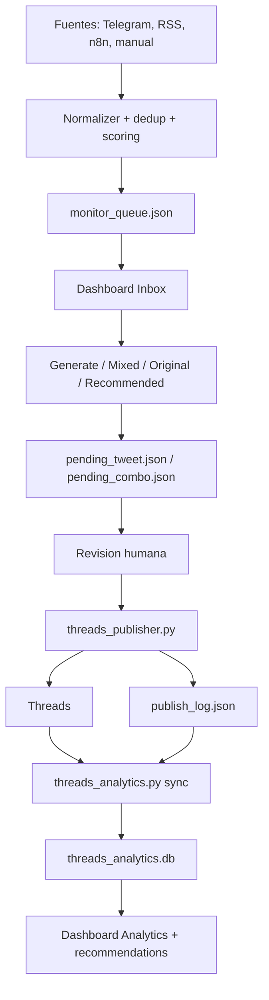

# Sol Bot

Sol Bot es un command center editorial para Threads. Recibe senales de noticias desde Telegram, RSS, n8n y endpoints manuales, las normaliza en un inbox revisable, ayuda a generar posts con criterio editorial, publica solo despues de revision humana y guarda analytics persistente para aprender que formatos y temas funcionan mejor.

El objetivo actual es claro:

- Threads-only: no publicar en X/Twitter.
- Human-in-the-loop: nada se publica directamente desde ingestion o inbox.
- Dashboard privado: Cloudflare Access + login interno.
- Inbox priorizado: fuentes, scoring, deduplicacion y filtros.
- Pending revisable: post o combo se revisan antes de publicar.
- Analytics persistente: SQLite para ranking por formato, tema, media y longitud.
- Operacion segura: backups antes de deploy, CSRF en mutaciones, logs utiles y limpieza de media temporal.

## Arquitectura



## Proceso Editorial

1. Una fuente entra por Telegram, RSS, n8n o `POST /api/monitor/ingest`.
2. `ingestion_utils.py` normaliza el payload, calcula `dedup_key`, score y `priority_label`.
3. La alerta se guarda o se consolida en `monitor_queue.json` con `FileLock`.
4. El dashboard muestra el inbox con filtros, prioridad, fuente, tema, razones del score y media preview.
5. El operador puede ignorar, guardar ediciones, crear `WIRE`, `ANALISIS`, `COMBINADA`, `ORIGINAL` o usar la recomendacion basada en analytics.
6. La accion crea un pending revisable: `pending_tweet.json` o `pending_combo.json`.
7. El pending se edita, valida, regenera o publica manualmente.
8. `threads_publisher.py` publica texto, imagen, carrusel o video en Threads.
9. Solo despues de confirmacion real (`threads_success` + `threads_post_id`) se borra el pending publicado.
10. Si la media fue descargada temporalmente desde RSS/BBC, se borra del VPS despues de publicar correctamente.
11. `publish_log.json` registra resultado, tipo de media, formato, tema, errores y metadata.
12. `threads_analytics.py` sincroniza metricas reales desde Threads a SQLite.
13. `recommendation_engine.py` usa analytics historico para sugerir formato, longitud y tema.

## Servicios En VPS

Ruta esperada de produccion:

```bash
/root/x-bot/sol-bot
```

Servicios principales:

| Servicio | Funcion |
|---|---|
| `sol-dashboard.service` | Dashboard FastAPI privado en `127.0.0.1:8502`, expuesto por Cloudflare Tunnel. |
| `sol-commands.service` | Bot de control por Telegram para generar, publicar, resetear y operar pendientes. |
| `xbot-monitor.service` | Monitor de canales Telegram que llena el inbox. El nombre conserva legado, pero el flujo activo es Threads-only. |
| `sol-rss-fetcher.timer` | Ejecuta ingestion RSS periodicamente. |
| `sol-rss-fetcher.service` | Job one-shot que corre `rss_fetcher.py sync`. |
| `sol-threads-analytics.timer` | Sincroniza analytics de Threads cada hora. |
| `sol-threads-analytics.service` | Job one-shot que corre `threads_analytics.py sync`. |
| `cloudflared` | Tunnel de Cloudflare para `https://sol.theclamletter.com`. |
| `nginx` | Sirve piezas auxiliares como media local cuando aplica. |

Comandos utiles en VPS:

```bash
systemctl status sol-dashboard.service sol-commands.service xbot-monitor.service
systemctl status sol-rss-fetcher.timer sol-threads-analytics.timer cloudflared nginx
journalctl -u sol-dashboard.service -n 100 --no-pager
journalctl -u sol-rss-fetcher.service -n 100 --no-pager
journalctl -u sol-threads-analytics.service -n 100 --no-pager
```

## Configuracion

Copia `.env.example` a `.env` en el VPS y completa valores reales. Nunca commitear `.env`.

Variables criticas:

| Variable | Uso |
|---|---|
| `DASHBOARD_PASSWORD_HASH` | SHA-256 de la clave interna del dashboard. Obligatoria. |
| `DASHBOARD_SESSION_TTL_MIN` | Duracion de sesion del dashboard. |
| `INGEST_API_TOKEN` | Bearer token para `POST /api/monitor/ingest`. |
| `INGEST_RATE_LIMIT_PER_MIN` | Proteccion basica contra floods de ingestion. |
| `THREADS_ACCESS_TOKEN` | Token de Meta/Threads usado para publicar y analytics. |
| `THREADS_USER_ID` | Usuario Threads/Meta donde se publica. |
| `THREADS_IMAGE_HOST` | `litterbox` por defecto para URLs HTTPS temporales de imagen. |
| `THREADS_VIDEO_HOST` | `litterbox` por defecto para URLs HTTPS temporales de video. |
| `THREADS_MEDIA_HOST` | Host propio si se usa media local HTTPS. |
| `TELEGRAM_SOURCE_CHANNEL_IDS` | Canales Telegram monitoreados. |
| `SOL_MONITORED_SERVICES` | Servicios visibles en dashboard System. |

## Dashboard

URL de produccion:

```text
https://sol.theclamletter.com
```

Capas de acceso:

1. Cloudflare Access.
2. Login interno del dashboard.
3. CSRF obligatorio en rutas mutantes autenticadas.

Tabs moviles:

- `Inbox`: noticias priorizadas.
- `Pending`: posts y combos pendientes.
- `Create`: generacion manual y mixed builder.
- `Analytics`: ranking diario/semanal/mensual.
- `System`: servicios, estado y controles.

En desktop se mantiene el layout operativo completo con drawer/inbox y paneles.

## Ingestion Multi-Fuente

Endpoint:

```http
POST /api/monitor/ingest
Authorization: Bearer <INGEST_API_TOKEN>
Content-Type: application/json
```

Payload esperado:

```json
{
  "external_id": "bbc-world-123",
  "source_name": "BBC World",
  "source_type": "rss",
  "canonical_url": "https://www.bbc.com/news/...",
  "headline": {
    "title": "Headline",
    "summary": "Short context"
  },
  "media_urls": [],
  "metadata": {
    "credibility": "high",
    "category": "geopolitica",
    "priority": "normal",
    "language": "en"
  }
}
```

`source_config.json` define fuentes RSS/webhook/manual/Telegram, prioridad base, credibilidad, categorias, idioma y si descarga imagenes para fuentes de alta prioridad.

## Scoring Del Inbox

El score es rule-based, auditable y de 0 a 100. No usa ML.

Labels:

- `breaking`
- `high`
- `normal`
- `low`
- `duplicate`
- `unverified`

Cada alerta puede incluir `score_reasons`, por ejemplo:

- `trusted source`
- `official source`
- `canonical URL`
- `relevant topic`
- `numbers/data`
- `breaking keywords`
- `multiple sources`
- `no canonical URL`
- `possible duplicate`
- `unverified source`

El inbox ordena por banda editorial, luego score, fuente y recencia.

## Publicacion Threads

`threads_publisher.py` es el unico publicador activo. Soporta:

- texto,
- imagen,
- carrusel,
- video normalizado.

Reglas importantes:

- Max tecnico de post principal: 500 caracteres.
- Replies se mantienen con ritmo de 280 caracteres.
- Videos se normalizan con `ffmpeg` antes de publicar.
- Imagenes se normalizan a JPEG compatible.
- Threads requiere URL HTTPS publica para media.
- Si falla Meta, se conserva el pending para retry.
- No se borra pending ni media temporal hasta confirmar `threads_post_id`.

## Analytics

`threads_analytics.py` guarda snapshots en `threads_analytics.db`.

Tablas:

- `posts`: metadata del post.
- `post_snapshots`: views, likes, replies, reposts, quotes, engagement.
- `sync_runs`: ejecuciones de sync y errores.

CLI:

```bash
python3 threads_analytics.py fetch --limit 20
python3 threads_analytics.py sync --limit 50
python3 threads_analytics.py summary --days 7
```

Dashboard API:

```http
GET /api/threads/analytics?days=1&limit=50&sort=views
POST /api/threads/analytics/sync
```

Filtros soportados:

- rango: `1`, `7`, `30` dias,
- sort: `views`, `likes`, `replies`, `comments`, `engagement`, `total_engagement`, `date`,
- formato,
- tema,
- media/text.

## Recomendaciones

`recommendation_engine.py` cruza alerta + analytics historico para sugerir:

- formato recomendado,
- tema,
- longitud,
- uso de media,
- confianza,
- razones.

La recomendacion no publica. Solo ayuda a crear un pending revisable.

## Archivos Runtime Ignorados

Estos archivos viven en el VPS/local pero no deben entrar al repo:

- `.env`
- `monitor_queue.json`
- `monitor_pending.json`
- `pending_tweet.json`
- `pending_combo.json`
- `pending_media.json`
- `publish_log.json`
- `threads_analytics.db*`
- `*.session`
- `media/`
- `logs/`
- `__pycache__/`

## Mapa De Archivos Versionados

| Archivo | Funcion |
|---|---|
| `.env.example` | Plantilla segura de variables de entorno. No contiene secretos reales. |
| `.gitignore` | Ignora runtime state, DBs, sesiones, logs, caches y secretos. |
| `README.md` | Documentacion principal de arquitectura, operacion, flujo y mapa de archivos de Sol. |
| `backup_bot.py` | Crea backups de archivos operativos y permite listar/limpiar backups. |
| `brain.py` | Interpreta comandos en lenguaje natural y decide acciones del bot. |
| `config.py` | Carga `.env` y helpers tipados para variables de entorno. |
| `content_calendar.py` | Genera contenido programado/editorial desde headlines. |
| `content_utils.py` | Utilidades para normalizar y sanear texto generado. |
| `dashboard_access.md` | Documentacion de acceso privado via Cloudflare/dashboard. |
| `data_strategy.md` | Notas de estrategia de datos/fuentes. |
| `docs/sol_dashboard_mockup.html` | Mockup historico/visual del dashboard. |
| `docs/sol_dashboard_proposal.md` | Propuesta historica del dashboard. |
| `docs/sol_dashboard_research_prompt_en.md` | Prompt de investigacion para dashboard. |
| `evaluate_posts.py` | Evalua posts con juez LLM y guarda resultados/historial. |
| `fetcher.py` | Fetcher simple de headlines legacy/auxiliar. |
| `filter.py` | Detecta contenido sensible o que conviene evitar. |
| `gdelt_spike_logic.js` | Logica JS para detectar spikes GDELT. |
| `gdelt_spike_runner.js` | Runner JS para ejecutar la logica GDELT. |
| `generator.py` | Motor principal de generacion de posts, combos y threads. |
| `http_utils.py` | Helpers HTTP con retry/backoff y SSL configurable. |
| `image_fetcher.py` | Busca imagenes por keywords para posts. |
| `image_manager.py` | Gestiona libreria local de imagenes custom. |
| `ingestion_utils.py` | Normaliza payloads, deduplica, calcula score y mergea alertas. |
| `main.py` | Entrada simple del bot/generacion principal. |
| `memory.py` | Memoria local de Sol para continuidad/contexto. |
| `monitor.py` | Escucha canales Telegram, guarda media y llena inbox. |
| `multi_source_ingestion.md` | Documentacion del ingestion layer multi-fuente. |
| `n8n_gdelt_alert_workflow.json` | Workflow n8n para alertas GDELT hacia Sol. |
| `n8n_setup.md` | Guia para configurar n8n con Sol. |
| `options_scored.md` | Notas de opciones/fuentes/estrategia puntuadas. |
| `promptfoo_gdelt_logic.yaml` | Evals Promptfoo para logica GDELT. |
| `promptfoo_reply_gen.yaml` | Evals Promptfoo para generador de replies. |
| `promptfoo_sol_quality.yaml` | Evals Promptfoo de calidad editorial Sol. |
| `recommendation_engine.py` | Recomendaciones por analytics historico. |
| `reply_gen_prompt.json` | Prompt estructurado para replies. |
| `reply_gen_user_msg.txt` | Mensaje usuario base para replies. |
| `reply_generator_prompt.txt` | Prompt textual legacy/auxiliar para replies. |
| `reply_scanner.py` | Genera sugerencias de replies para cuentas/posts monitoreados. |
| `requirements.txt` | Dependencias Python. |
| `rss_fetcher.py` | Lee `source_config.json`, descarga RSS y llena inbox. |
| `scheduler.py` | Flujo programado para generar/publicar posts desde calendario. |
| `settings.py` | Configuracion del dashboard, auth y servicios monitoreados. |
| `sol_commands.py` | Bot de comandos por Telegram: generar, regenerar, publicar, resetear. |
| `sol_dashboard_api.py` | FastAPI dashboard, APIs, auth, CSRF, inbox, pending, publish, analytics. |
| `sol_evaluator_prompt.json` | Prompt JSON para evaluar calidad de posts. |
| `sol_post_evaluator_prompt.txt` | Prompt textual para evaluador de posts. |
| `source_config.json` | Config de fuentes RSS/webhook/manual/Telegram. |
| `static/icon-192.png` | Icono PWA/dashboard 192px. |
| `static/icon-512.png` | Icono PWA/dashboard 512px. |
| `static/manifest.json` | Manifest PWA del dashboard. |
| `static/sw.js` | Service worker del dashboard/PWA. |
| `systemd/sol-rss-fetcher.service` | Unit systemd para sync RSS one-shot. |
| `systemd/sol-rss-fetcher.timer` | Timer systemd para RSS periodico. |
| `systemd/sol-threads-analytics.service` | Unit systemd para sync analytics one-shot. |
| `systemd/sol-threads-analytics.timer` | Timer systemd para analytics horario. |
| `telegram_client.py` | Cliente Telegram para mensajes, fotos, grupos y videos. |
| `templates/dashboard.html` | UI completa del dashboard desktop/mobile. |
| `tests/brain_test.yaml` | Casos de prueba para intents/acciones de `brain.py`. |
| `threads_analytics.md` | Guia operativa de analytics Threads. |
| `threads_analytics.py` | Sync, DB y consultas de analytics Threads. |
| `threads_publisher.py` | Publicador oficial a Threads con media/errores/resultado estructurado. |
| `topic_utils.py` | Clasificador local simple de temas. |
| `trending_scanner.py` | Scanner de temas/tendencias y sugerencias editoriales. |

## Endpoints Principales Del Dashboard

| Endpoint | Metodo | Uso |
|---|---|---|
| `/` | GET | Dashboard HTML. |
| `/login` | POST | Login interno. |
| `/api/csrf-token` | GET | Token CSRF para mutaciones. |
| `/api/status` | GET | Estado general, servicios y runtime. |
| `/api/pending` | GET | Pending post/combo/monitor. |
| `/api/generate` | POST | Crear pending post desde texto. |
| `/api/mixed` | POST | Crear pending combo. |
| `/api/generate/regenerate` | POST | Regenerar pending post. |
| `/api/pending/combo/save` | POST | Guardar texto editado de combo. |
| `/api/pending/combo/regenerate` | POST | Regenerar combo preservando metadata/media. |
| `/api/publish` | POST | Publicar pending en Threads. |
| `/api/reset` | POST | Limpiar pendientes. |
| `/api/monitor/queue` | GET | Inbox enriquecido y ordenado. |
| `/api/monitor/ingest` | POST | Ingesta externa protegida por bearer token. |
| `/api/monitor/save/{alert_id}` | POST | Guardar edicion de alerta. |
| `/api/monitor/bulk-ignore` | POST | Ignorar multiples alertas. |
| `/api/monitor/action/{alert_id}` | POST | Crear pending desde alerta o ignorar. |
| `/api/recommendation/alert/{alert_id}` | GET | Recomendacion por alerta. |
| `/api/threads/analytics` | GET | Analytics persistente filtrable. |
| `/api/threads/analytics/sync` | POST | Sync manual de analytics. |
| `/api/replies/generate` | POST | Generar replies. |
| `/api/signals` | GET | Senales GDELT/Polymarket/mercados. |

## Validacion Local

Compilar Python principal:

```bash
python3 -m py_compile \
  sol_dashboard_api.py \
  sol_commands.py \
  generator.py \
  threads_publisher.py \
  threads_analytics.py \
  rss_fetcher.py \
  ingestion_utils.py \
  recommendation_engine.py
```

Validar JS inline del dashboard con Node:

```bash
python3 - <<'PY'
import re, pathlib
html = pathlib.Path('templates/dashboard.html').read_text()
scripts = re.findall(r'<script[^>]*>(.*?)</script>', html, re.S)
for i, script in enumerate(scripts, 1):
    pathlib.Path(f'/tmp/sol_dashboard_inline_{i}.js').write_text(script)
print(len(scripts))
PY
for f in /tmp/sol_dashboard_inline_*.js; do node --check "$f"; done
```

Validar JSON/YAML relevante:

```bash
python3 -m json.tool source_config.json >/tmp/source_config_check
python3 -m json.tool n8n_gdelt_alert_workflow.json >/tmp/n8n_check
```

## Deploy Seguro

Patron recomendado:

1. Verificar `git status` local.
2. Hacer backup en VPS de archivos tocados.
3. Copiar solo archivos versionados necesarios.
4. Compilar Python.
5. Validar JS inline si toca dashboard.
6. Reiniciar servicios afectados.
7. Confirmar `systemctl is-active`.
8. Smoke test dashboard y endpoint afectado.
9. Commit local.
10. Push/PR a GitHub.

Ejemplo de reinicio:

```bash
systemctl restart sol-dashboard.service sol-commands.service
systemctl is-active sol-dashboard.service sol-commands.service
```

## Roadmap Cercano

- Reliability / Operacion Pro: healthchecks, token Threads, alertas, backups y system events.
- Media Studio: reordenar/quitar imagenes, validar dimensiones, preview mejorado, video diagnostics.
- Source Expansion: mas RSS/APIs/newsletters con scoring, dedup y politicas de licencia.
- Prompt Evaluation Harness: usar Promptfoo para proteger prompts contra regresiones, spam e instrucciones maliciosas.
